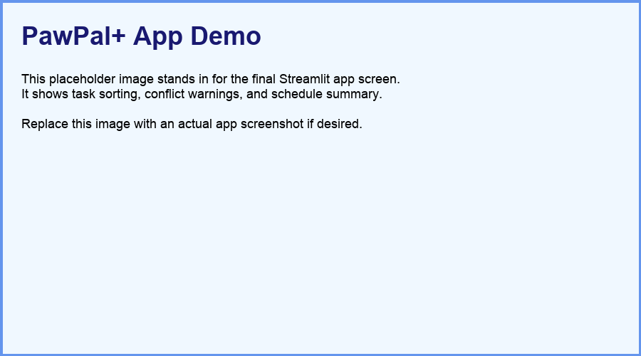

# PawPal+ (Module 2 Project)

You are building **PawPal+**, a Streamlit app that helps a pet owner plan care tasks for their pet.

## Scenario

A busy pet owner needs help staying consistent with pet care. They want an assistant that can:

- Track pet care tasks (walks, feeding, meds, enrichment, grooming, etc.)
- Consider constraints (time available, priority, owner preferences)
- Produce a daily plan and explain why it chose that plan

Your job is to design the system first (UML), then implement the logic in Python, then connect it to the Streamlit UI.

## What you will build

Your final app should:

- Let a user enter basic owner + pet info
- Let a user add/edit tasks (duration + priority at minimum)
- Generate a daily schedule/plan based on constraints and priorities
- Display the plan clearly (and ideally explain the reasoning)
- Include tests for the most important scheduling behaviors

## Getting started

### Setup

```bash
python -m venv .venv
source .venv/bin/activate  # Windows: .venv\Scripts\activate
pip install -r requirements.txt
```

### Suggested workflow

1. Read the scenario carefully and identify requirements and edge cases.
2. Draft a UML diagram (classes, attributes, methods, relationships).
3. Convert UML into Python class stubs (no logic yet).
4. Implement scheduling logic in small increments.
5. Add tests to verify key behaviors.
6. Connect your logic to the Streamlit UI in `app.py`.
7. Refine UML so it matches what you actually built.

## Features

- Sorting by task start time or priority
- Filtering tasks by pet and completion status
- Daily and weekly recurring task generation
- Conflict detection for duplicate task start times
- Schedule generation that respects owner time budget

## Smarter Scheduling

PawPal+ now sorts tasks by scheduled start time, filters tasks by pet or completion status, handles daily and weekly recurring tasks, and detects simple start-time conflicts. These improvements help the owner see a clean plan and avoid scheduling collisions.

## Demo

<a href="./course_images/ai110/pawpal_demo.png" target="_blank"></a>

## Testing PawPal+

Run the automated tests with:

```bash
python -m pytest
```

The tests cover task completion, pet task assignment, chronological sorting, daily recurrence creation, and detection of duplicate start-time conflicts.

**Confidence Level:** ★★★★☆
